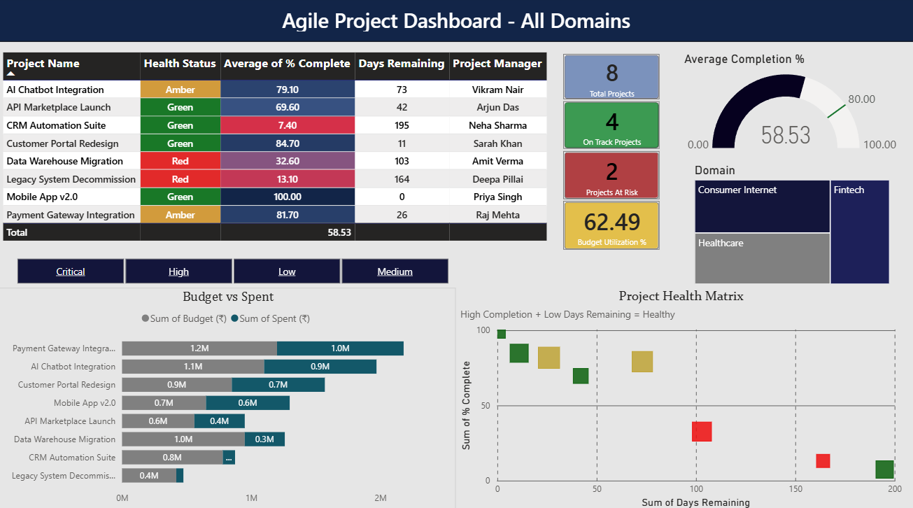
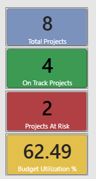
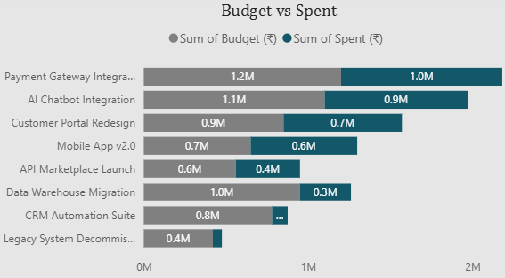

# 📊 Agile Project Portfolio Dashboard

## Overview

The **Agile Project Portfolio Dashboard** is an executive-level Power BI solution designed to monitor and analyze Agile project performance across an organization. The dashboard provides interactive insights into project health, budget utilization, project completion, and portfolio performance, enabling project managers and leadership teams to make informed business decisions.

---

## Dashboard Screenshots

### Dashboard Overview


### Executive KPIs



### Budget Analysis



### Project Health


---

## Business Problem

Organizations managing multiple Agile projects often lack a centralized solution to monitor project health, budget consumption, delivery progress, and overall portfolio performance.

This dashboard provides a single source of truth that helps stakeholders:

* Monitor overall project health
* Identify projects at risk
* Track budget utilization
* Compare planned budget with actual spending
* Analyze project completion across domains

---

## Dashboard Features

* Executive KPI Cards
* Project Health Monitoring
* Budget vs Actual Spend Analysis
* Average Project Completion Tracking
* Domain-wise Project Distribution
* Interactive Filters & Slicers
* Dynamic Dashboard Title using DAX
* Responsive Dashboard Design

---

## Key Performance Indicators (KPIs)

* Total Projects
* Projects On Track
* Projects At Risk
* Average Completion %
* Budget Utilization %
* Days Remaining

---

## DAX Measures

The dashboard uses DAX to calculate key business metrics, including:

* Total Projects
* Projects On Track
* Projects At Risk
* Average Completion %
* Budget Utilization %
* Dynamic Dashboard Title

A detailed explanation of every measure, along with the DAX formulas and business purpose, is available in:

**Documentation/DAX_Measures.pdf**

---

## Tools & Technologies

* Microsoft Power BI Desktop
* Power Query
* DAX (Data Analysis Expressions)
* Microsoft Excel

---

## Dataset

The dashboard is built using a sample Agile project dataset containing the following fields:

* Project ID
* Project Name
* Domain
* Budget (₹)
* Actual Spend (₹)
* Completion Percentage
* Health Status
* Days Remaining
* Project Manager

---

## Business Value

This dashboard enables project managers and business leaders to:

* Monitor portfolio performance in real time
* Detect high-risk projects early
* Optimize budget utilization
* Track project completion progress
* Support data-driven decision-making

---

## Repository Structure

```text
PowerBI-Agile-Project-Dashboard
│
├── README.md
├── Agile_Project_Dashboard.pbix
│
├── Data
│   └── Agile_Project_Data.xlsx
│
├── Documentation
│   ├── Dashboard_Documentation.pdf
│   └── DAX_Measures.pdf
│
└── Images
    ├── Dashboard_Overview.png
    ├── Executive_KPIs.png
    ├── Budget_Analysis.png
    └── Project_Health.png
```

---

## Future Enhancements

* Drill-through Pages
* Gantt Chart Visualization
* Forecasting
* Resource Utilization Dashboard
* Power BI Service Deployment
* Row-Level Security (RLS)

---

## Skills Demonstrated

* Data Modeling
* Power Query (ETL)
* DAX Measure Development
* Data Visualization
* Dashboard Design
* Business Intelligence
* KPI Development
* Agile Project Reporting

---

## Documentation

Additional project documentation is available in the **Documentation** folder:

* Dashboard_Documentation.pdf
* DAX_Measures.pdf

---

## Author

**Mehwish Shahzad**
